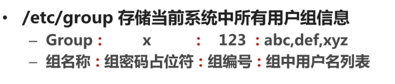
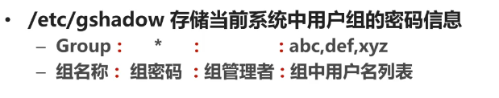
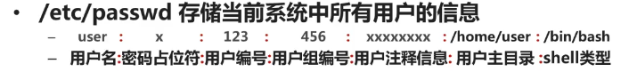
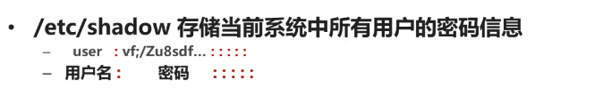
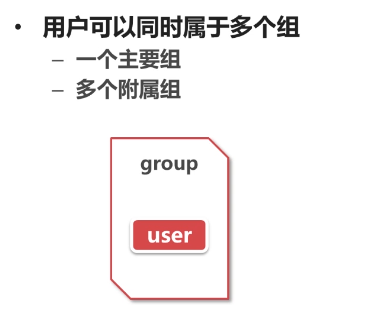
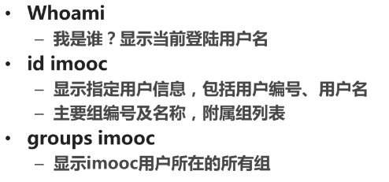
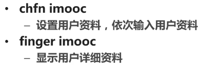

下面是关于用户组与用户的内容
### 1.用户与组文件
#### 1.1 用户与组/etc/group
类似于我们自己的床铺。而床铺的使用权要root用户进行分配。在linux中我们的root的用户的组号必须是0！1-499是系统预留的组编号，预留给系统安装的默认的一些软件或者服务的，如MySql。如果安装了mysql，那么就会有一个mysql组！500-为用户手动创建的用户组。组密码占位符全部是`x`表示
```bash
root:x:0:
```
如下图：



#### 1.2 用户组密码信息/etc/gshadow
该文件每一行与/etc/group每一行对应。组密码为空，"*"或者"!"那么组密码是空，也就是没有密码！
如下图：



#### 1.3 /etc/passwd存储当前系统中所有用户的信息
每一行对应一个用户的信息。用户备注表示:"创建用户的时候的备注，如性别"。除了root用户外，每一个用户在创建的时候都会在home目录下创建一个与用户名相同的目录，作为个人文件存储目录！
如下图：



#### 1.4 /etc/shadow存储系统中所有用户的密码
密码已经加密，包括其他的如什么时候修改，创建等.如下图：



### 2.用户与组命令

#### 2.1删除添加修改用户组
```bash
groupadd sexy
#添加sexy组
groupmod -n market sexy
#修改sexy组名为market
groupmod -g 668 market
#修改market用户组的编号修改为668
groupadd -g 888 boss
#创建boss用户组，并且组的编号为888
groupdel market
#删除market用户组，但是删除用户组之前必须删除用户组中的用户，否则用户配置文件中关于用户组的信息就无法跟组对应上，从而变成黑户
```
#### 2.2用户本身信息有关
```bash
groupadd sexy
#添加组
useradd -g sexy sdf
#指定用户组为sexy,用户为sdf
useradd -g sexy jzmb
#添加用户
useradd -d /home/xxx imooc
#创建用户指定用户文件夹为/home/xxx
usermod -c dgdzmx sdf
#为用户添加注释
usermod -l cls sdf
#将新的用户名写在前面，旧的用户名在后面。表示删除sdf用户了，同时添加了一个新的用户
usermod -d /home/cls cls
#修改cls个人文件夹
usermod -g sexy imocc
#修改用户用户组。将imocc用户放在sexy组中
userdel jzmb
#删除账号，但是无法删除个人文件夹
userdel -r jzmb
#删除账号同时删除个人文件夹
touch /etc/nologin
#暂时禁止普通账户登录服务器，root依然可以登录。创建该文件夹就ok了
```
#### 2.3锁定账户
```bash
passwd -l cls
#锁定用户账号
passwd -u cls
#解锁账号
passwd -d cls
#清除密码，可以无密码登录
```
### 3.主要组与附属组
cls担任了秘书的情况，其用下图可以表示：



下面是演示命令:
```bash
gpasswd -a cls boss
#添加附属组boss，而usermod -g修改的是主要用户组
#如果用户属于多个组，那么创建的文件属于主要组，如果要用附属组创建文件，那么要首先把身份临时切换到附属组
newgrp boss
#切换到附属组，此时要求输入组密码，这就是组密码的用处
gpasswd -d cls boss
#去掉组身份
useradd -g group1 -G group2,group3
#同时指定主要组与附属组,其中-G指定附属组
gpasswd imocc
#改变组密码
```
### 4.用户组有关其他命令
可以通过下图来看到:





```bash
su username
#用户身份切换到username,没有参数表示切换到root。普通用户可以切换到root但是需要密码，root切换到普通用户不需要密码
```
