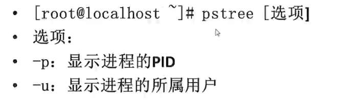

进程管理的基本概念

#### 1.什么是进程？


ls本身就是一个程序(c语言程序包，在lib目录下)，所以也是一个进程。apache进程是常驻进程(apache最多产生2000个并发进程，每一个请求都会产生一个)，而ls并不是的，这一点是主要差别。`所有的程序，只要运行，至少有一个进程产生`！
那么我们为什么要进行进程管理呢：


#### 2.进程的查看ps命令与pstree命令


该命令打印的结果如下：


你可以通过`ps aux`或者`ps -le`任何一个命令。其中前者不能有`-`字符，但是如果加上也是没有问题的，可以正常输出内容。其中PID为1的进程是最顶级的进程，是所有进程的父进程；如果TTY为问号，那么表示进程不是通过终端启动的，而是内核直接启动的，也就是系统进程；其中TIME表示当前进程耗费的CPU运算时间，时间越长表示越耗资源；通过COMMAND列知道当前运行的程序。进程所处的可能状态如下：


当然你也可以通过pstree来以进程树的形式来输出进程！



#### 3.进程的查看--top命令
该命令的配置参数为：


该命令用于查看所有的进程的健康状态。默认按照cpu占用率来排序。第一列为当前时间；第二列为服务器已经持续运行的时长；第三列为当前有多少用户登录；系统1分钟之前，五分钟之前，15分钟之前平均负载(15分钟之内`CPU和内存`占比的平均值，通过CPU核数来判断，如果2核数那么不应该大于2，4核不能大于4，但是是经验值。);下一列表示当前系统总共的进程数量，并给出运行的，休眠的等进程个数(僵尸进程表示`其依赖的底层进程已经关闭了`，所以我们应该要手动检查一下,只有长期存在才需要手动关闭，保证不是卡住的进程)；CPU空闲百分比等等。`缓冲Buffer加速写入(最后一次性写入)，缓存是加速读取(放在内存中一次读取)`！

```bash
top -b -n 1 > top.log
#-n刷新几次看进程占用结果；-b将所有的进程的结果写到文件中
```
下面给出该命令的输出指标含义：

内存占用：


cpu占用：


虚拟内存:


参考资料：

[linux系统管理](http://www.imooc.com/learn/583)

[控制台，终端，tty，shell等概念的区别](http://www.2cto.com/os/201403/282583.html)

[bios](http://baike.baidu.com/link?url=kOzNhEveSklj5z9VC7bXXoNjI5038C9B7GYhfLK9vdn_Nsmyszt2eYZnjr5WnkjVdcqxg-U0LET7w1zoVUuJoa)

[Linux中终端和控制台区别：](http://www.cnblogs.com/fah936861121/p/6435112.html)